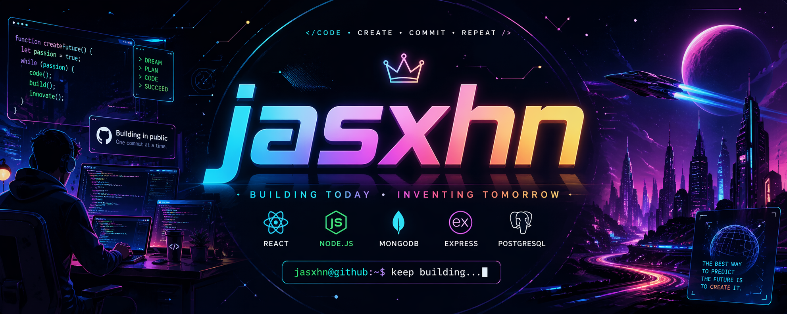

  

<h1 align="center">
  
    Hey, I'm Jashan
  
</h1>

  

 

---

# 🧠 About Me

- 🧩 Strong interest in **Data Structures & Algorithms**
- ⚙️ Building **Full Stack Applications**
- 🚀 Learning every day to build **powerful systems**
- 🐧 Love working with **Linux & the Terminal**
- 💡 Passionate about **problem solving and scalable tech**
- 🤖 Exploring **AI Prompting & developer productivity**

---

# 🛠 Tech Stack

## 💻 Languages

---

## 🎨 Frontend

---

## ⚙️ Backend

---

## 🗄 Database

---

## 🧰 Tools & Environment

---

# 📊 GitHub Stats

  
  

---

# 🔥 Contribution Streak

  

---

# 🚀 Current Focus

✨ Grinding Data Structures & Algorithms  
🚀 Building MERN Stack Projects  
🧠 Leveling up problem-solving mindset  

---

# 🌱 Coming Soon

⚡ TypeScript Mastery  
🏗️ System Design (Scalable Systems)  
🔥 Advanced Backend Engineering  

